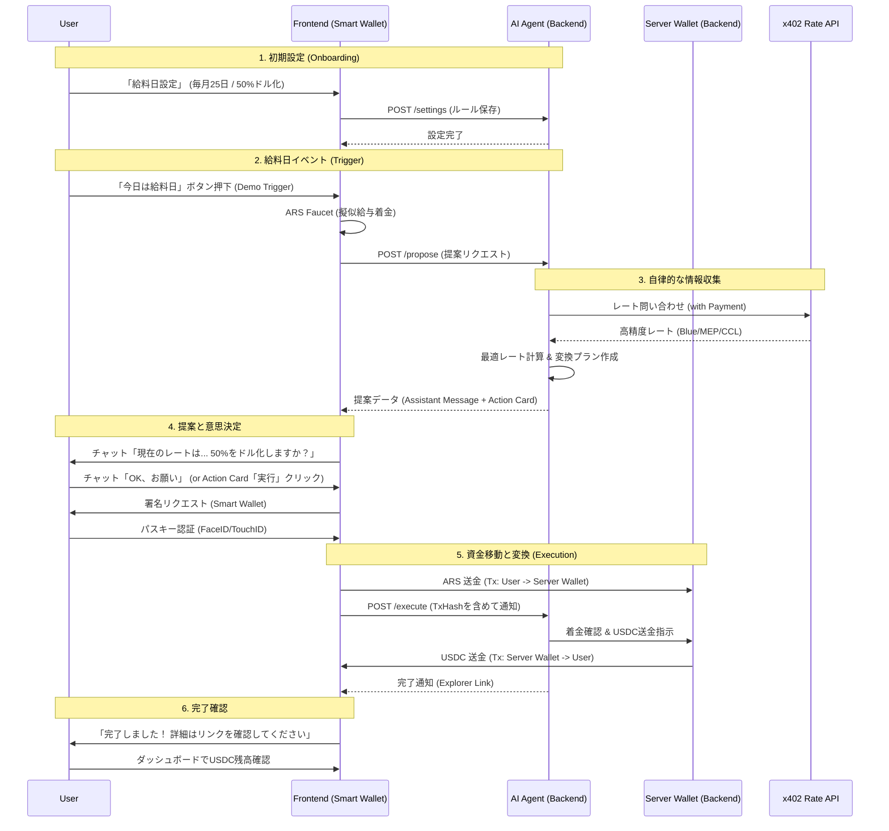

# DólarBlue AI Agent - Demo Flow Overview

本ドキュメントでは、ハッカソンデモにおけるユーザー体験（UX）と、バックグラウンドでのシステム連携（System Flow）を解説します。

## 登場人物 (Actors)

*   **User (Employee)**: アルゼンチン在住のユーザー。給与をARSで受け取り、安定したUSDCで保有したい。
*   **Smart Wallet (Frontend)**: ユーザーのブラウザ上で動作するCoinbase Smart Wallet。ARSの保持と送金署名を行う。
*   **AI Agent (Backend)**: ユーザーのファイナンシャルアシスタント。レート監視、提案、USDC変換（Server Wallet操作）を行う。
*   **x402 (External)**: 有料の自律型レート提供API。AI Agentが情報料を支払ってアクセスする。

---

## Demo Sequence Diagram

---

## Step-by-Step Demo Walkthrough

### Phase 1: Onboarding (設定)

1.  **User Action**: ダッシュボードの「設定」から、給料日を「25日」、自動ドル化割合を「50%」に設定する。
2.  **System**: Backend DBに `SalaryRule` として保存される。

### Phase 2: Payday Trigger (給料日)

3.  **User Action**: デモ用に用意された「給料日シミュレーション」ボタンを押す。
4.  **Frontend**:
    *   ユーザーのSmart Walletに、擬似的な給与（例: 150,000 ARS）がFaucetされる。
    *   Backendに「提案生成」をリクエストする。

### Phase 3: AI Proposal (AIによる提案)

5.  **System (Backend)**:
    *   `RateService` が `X402Service` を通じて、**AIが自律的にガス代を払って** 最新の為替レートを取得する。
    *   取得したレートに基づき、50%分（75,000 ARS）をUSDCに換えた場合の受取額を計算する。
    *   `LlmService` が「現在のレートは1 USDC = 1000 ARSです。設定通り50%を変換しますか？」という自然なメッセージを生成する。
6.  **Frontend**: チャット画面に「AIからのメッセージ」と「実行ボタン付きカード」が表示される。

### Phase 4: User Approval & Execution (承認と実行)

7.  **User Action**:
    *   チャットで「OK」と返信、またはカードの「実行」ボタンを押す。
    *   Smart Walletのポップアップが表示され、**パスキー（指紋/顔認証）で署名** する。
8.  **Frontend**:
    *   ARSを指定の Server Wallet アドレスへ送金するトランザクションを発行。
    *   完了後、TxHash を添えて Backend の `/execute` エンドポイントを叩く。

### Phase 5: Settlement (決済・着金)

9.  **System (Backend)**:
    *   受け取った TxHash を記録。
    *   Server Wallet から計算済みの USDC 額をユーザーのウォレットへ送金する。
    *   完了メッセージとExplorerへのリンクを返す。
10. **User Action**: チャット画面で「完了」を確認し、ダッシュボードでUSDC残高が増えていることを確認してデモ終了。

